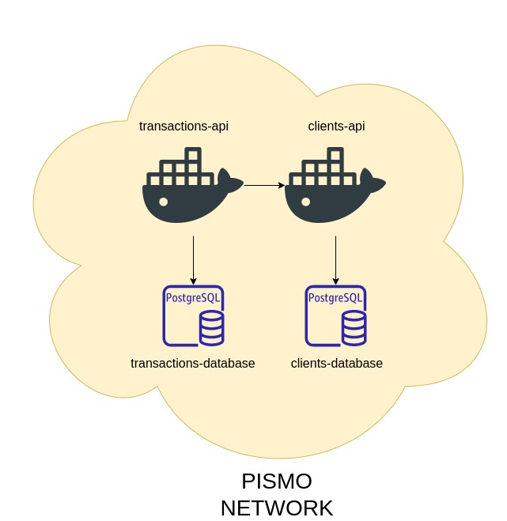

# Projeto pismo

## 💻 Tecnologias utilizadas na construção

* Linux
* Docker
* Docker Compose
* Spring boot + Java 11 para construção dos micro serviços
* PostgreSQL para o banco de dados
* FlyWay para a migração de banco de dados
* Git + GitHub + GitHub Actions para CI/CD

## 📝 Desenho da arquitetura

## 💻 Componentes da arquitetura

### Transactions Api

* Micro serviço Spring responsável por criar as transações do sistema

